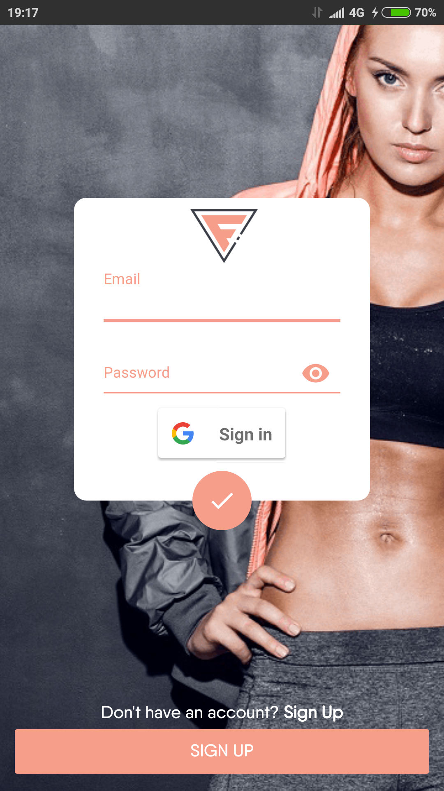
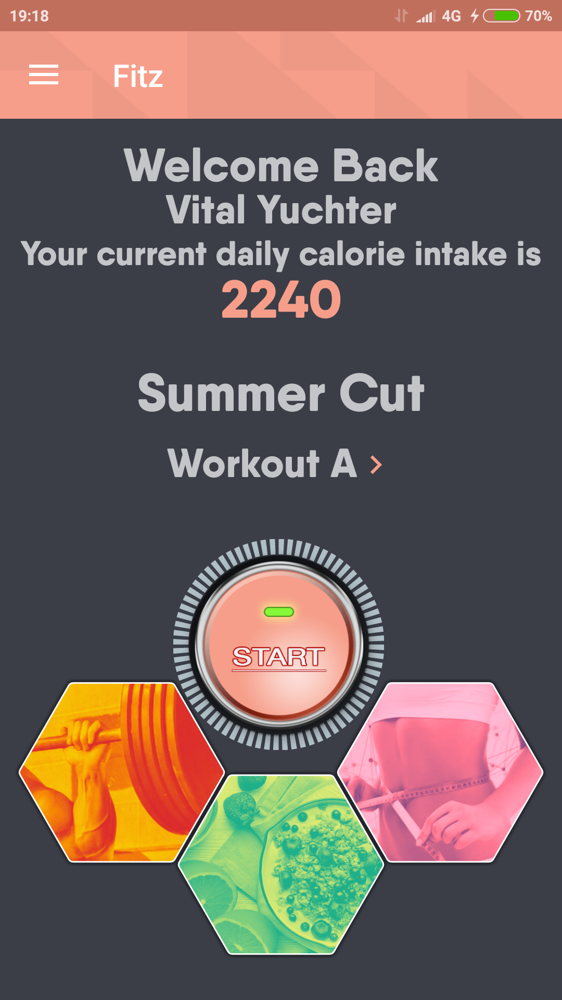
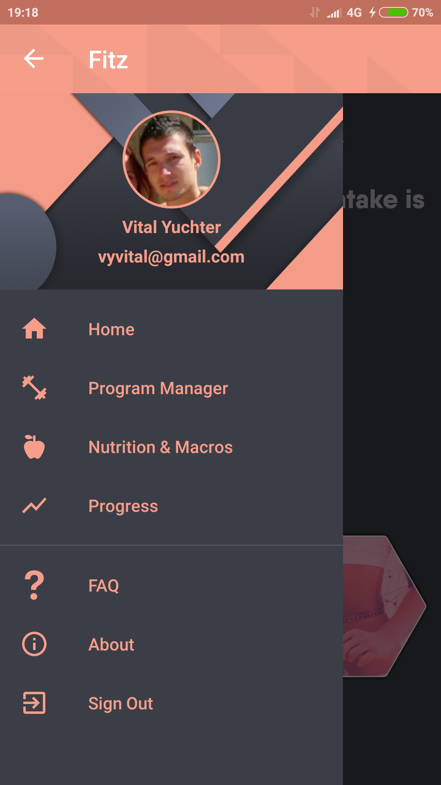
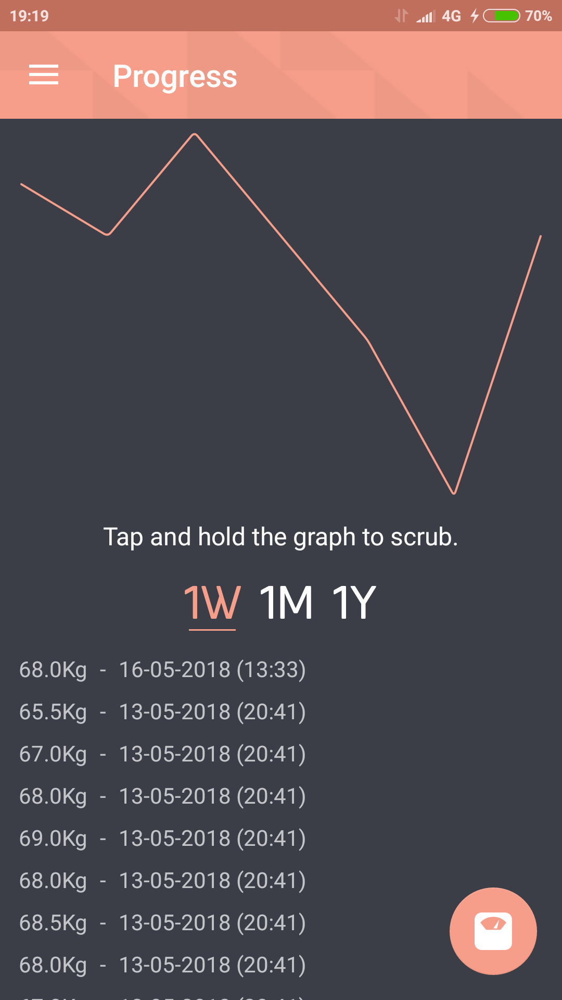
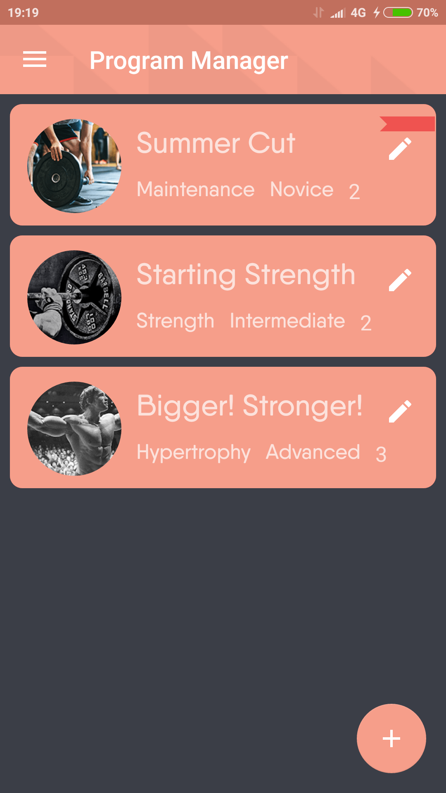
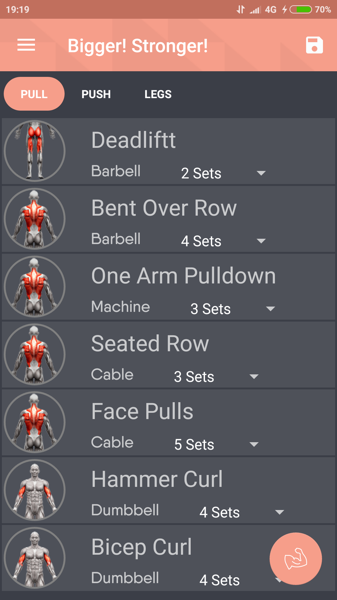
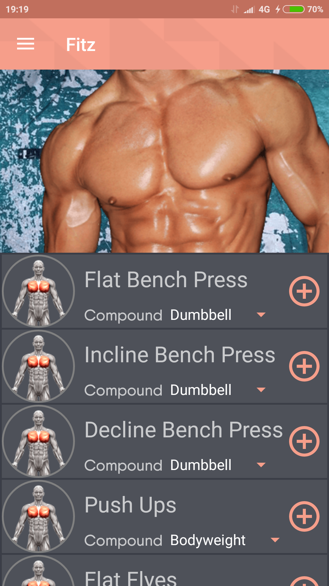
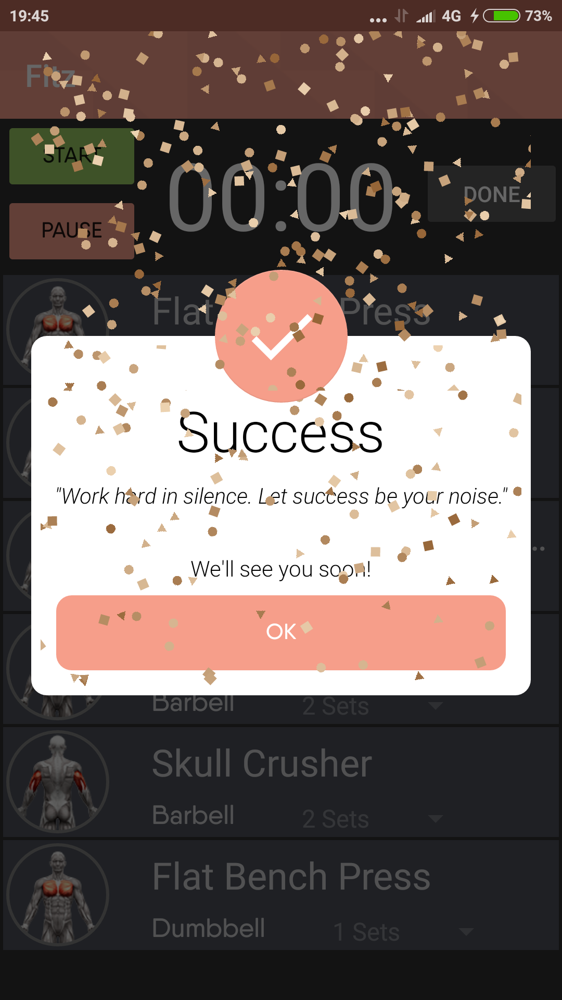
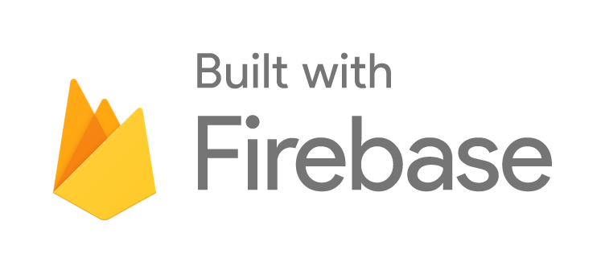

<p align="center">
<h2 align="center"><b>Fitz - Fitness Android App</b></h2>
<h4 align="center">An android application focused on achieving fitness and health goals in a more convenient way.</h4>

## [Download Fitz APK here](https://github.com/vyvital/Fitz/releases)
<a href="https://play.google.com/store/apps/details?id=vyvital.myfit" >
  
</a>


## Description

The fitness app that gets you results and turns helps you maintain a healthy lifestyle.
Build and adjust your workout routine and calorie intake on the go, no internet needed!
Contains the most effective and fresh exercises for each body part.
It's time you stop bringing your workout routine sheet to the gym and just pop into the app.

## Features

* Build and edit workout programs.
* Get a daily Macro/Calorie number to fit your goals.
* Follow your fitness and weight progress.
* Today's workout for staying on point.
* Add exercises from the database.
* Remove workouts and exercises with a swipe.
* Place exercises in the wanted position by swipe.
* Edit the sets, reps & weight for each exercise.
* Mark completed exercises.
* Supports offline.

## Screenshots

  
  
  

## Open-source libraries:

- [**Glide**](https://github.com/bumptech/glide) for loading images
- [**Fabric**](https://fabric.io/kits/android/crashlytics) analytics & crash reporting.
- [**AVLoadingIndicatorView**](https://github.com/81813780/AVLoadingIndicatorView) Loading animation.
- [**Spark**](https://github.com/robinhood/spark) Simple smooth sparkline chart.
- [**Toggle-Switch**](https://github.com/BelkaLab/Android-Toggle-Switch) Unique Toggle Switch.
- [**CircleImageView**](https://github.com/hdodenhof/CircleImageView) Circular ImageView.
- [**BubbleSeekBar**](https://github.com/woxingxiao/BubbleSeekBar) Custom seek bar.
- [**Circlebutton**](https://github.com/markushi/android-circlebutton) Animated FAB.
- [**StickySwitch**](https://github.com/GwonHyeok/StickySwitch) Beautiful switch widget with sticky animation.
- [**MPAndroidChart**](https://github.com/PhilJay/MPAndroidChart) A powerful & easy to use chart library for Android.
- [**Confetti**](https://github.com/jinatonic/confetti) Confetti particle animation.
- [**SmartTabLayout**](https://github.com/ogaclejapan/SmartTabLayout) Custom ViewPager stip.
- [**BetterSpinner**](https://github.com/Lesilva/BetterSpinner) Material EditText that works like a spinner.
- [**PolygonImageView**](https://github.com/AlbertGrobas/PolygonImageView) Custom ImageView with polygonal forms.
- [**ProgressViews**](https://github.com/natasam/DemoProgressViewsLibApp) Custom Progress Bars.
- [**BetterSpinner**](https://github.com/Lesilva/BetterSpinner) Material EditText that works like a spinner.

<p align="center">

## License
```
MIT License

Copyright (c) 2018 Vital Yuchter

Permission is hereby granted, free of charge, to any person obtaining a copy
of this software and associated documentation files (the "Software"), to deal
in the Software without restriction, including without limitation the rights
to use, copy, modify, merge, publish, distribute, sublicense, and/or sell
copies of the Software, and to permit persons to whom the Software is
furnished to do so, subject to the following conditions:

The above copyright notice and this permission notice shall be included in all
copies or substantial portions of the Software.

THE SOFTWARE IS PROVIDED "AS IS", WITHOUT WARRANTY OF ANY KIND, EXPRESS OR
IMPLIED, INCLUDING BUT NOT LIMITED TO THE WARRANTIES OF MERCHANTABILITY,
FITNESS FOR A PARTICULAR PURPOSE AND NONINFRINGEMENT. IN NO EVENT SHALL THE
AUTHORS OR COPYRIGHT HOLDERS BE LIABLE FOR ANY CLAIM, DAMAGES OR OTHER
LIABILITY, WHETHER IN AN ACTION OF CONTRACT, TORT OR OTHERWISE, ARISING FROM,
OUT OF OR IN CONNECTION WITH THE SOFTWARE OR THE USE OR OTHER DEALINGS IN THE
SOFTWARE.
```
